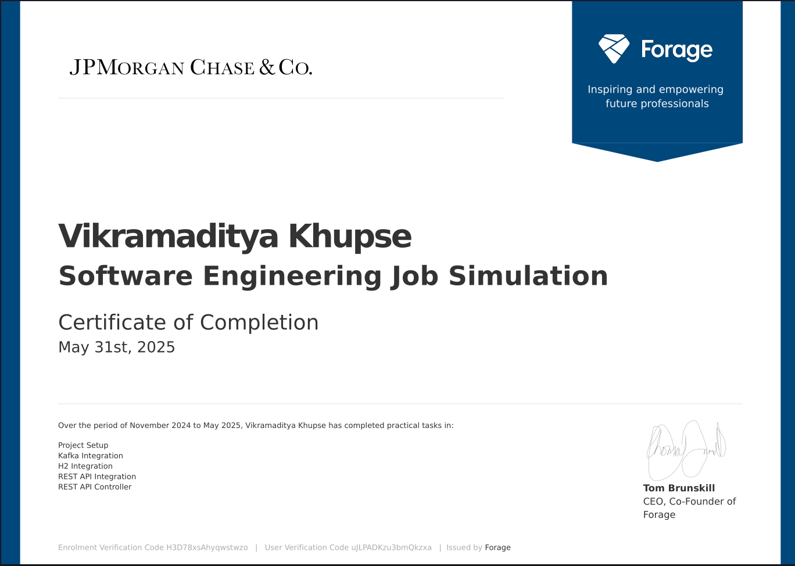

# Midas 💰
Project repository for the **JPMC Advanced Software Engineering Virtual Experience** on Forage.



---

## 🛠️ Tech Stack


---

## 📄 About

This project simulates a real-world financial backend system:
- Consumes transactions via **Kafka**
- Calculates incentives via an external **Incentive API**
- Persists data using **Spring Data JPA**
- Serves user balances via **REST endpoints**
- Uses **H2 in-memory database** for testing

It’s part of the virtual internship simulation offered by **J.P. Morgan & Co. on Forage** to gain hands-on experience with backend microservices, APIs, and messaging systems.

---

## 📸 Certificate

> Located at `assets/jpmc-advanced-software-cert.png`

---

## 📦 Run Locally

```bash
# Run incentive API
./gradlew :incentive-api:bootRun

# Run midas core
./gradlew :midas-core:bootRun
